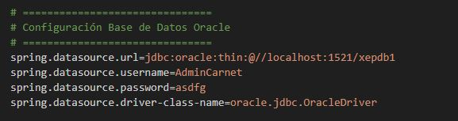
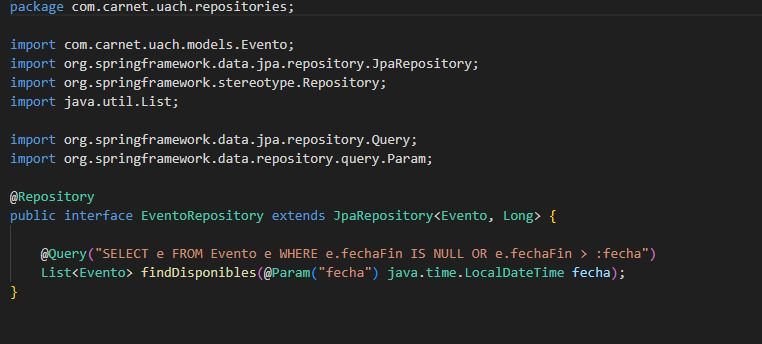
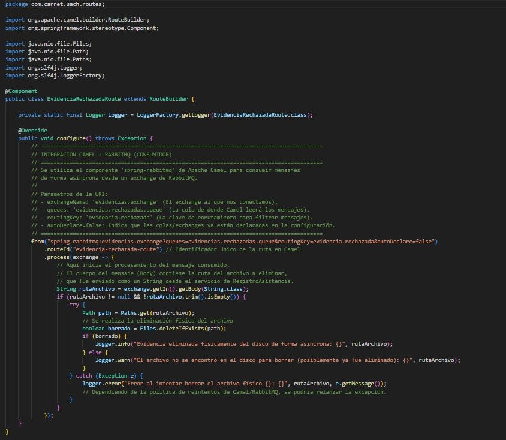
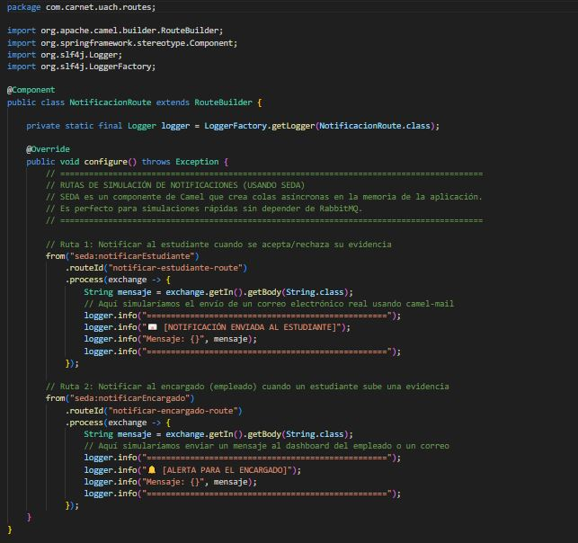
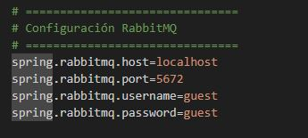
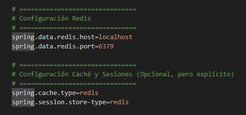
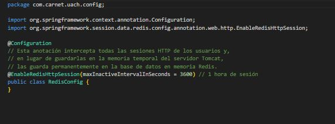
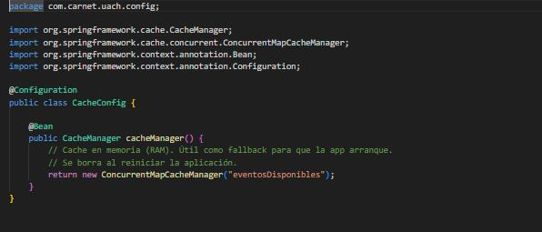

# Proyecto Final - Desarrollo Basado en Plataformas
## Sistema de Carnet Cultural 
# Integrantes:

377043 – Angel Rodriguez Palomino

377304 – Zahid Alberto Jimenes Pérez

377061 – Jared Isai López Espino

# Requisitos para el Proyecto Final:
* Implementación sobre el framework Spring Boot
* Manejo de base de datos (altas, bajas, cambios y consultas )
* Implementación de almenas 2 rutas de Apache Camel
* Plantilla de estilo admin
* Conexión con RabbitMq
* Opcional conexión a REDIS

# Puertos usados:
- 8080 - Aplicacion
- 6379 - REDIS
- 5672 - RabbitMQ 
- 1521 - Oracle 

# Interfaz
## Plantilla de estilo Admin 

# Base de datos:
## Conexion a base de datos oracle 

## Ejemplo repositorio para acceder a base de datos 

# Apache camel:
## Implementación de ruta 1
En esta implementacion de ruta  Se utiliza el componente 'spring-rabbitmq' de Apache Camel para consumir mensajes de forma asíncrona desde un exchange de RabbitMQ.

## Implementación de ruta 2
En esta implementacion de ruta donde se usa SEDA, el cual es un componente de Camel que crea colas asíncronas en la memoria de la aplicación. Es perfecto para simulaciones rápidas sin depender de RabbitMQ.

# RabbitMQ
## Conexión con RabbitMq

 

# REDIS
## Conexión a REDIS

 

## Redis config

## Cache config

