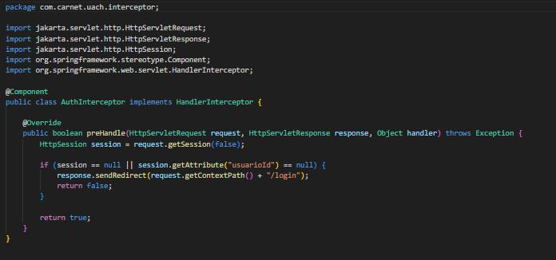

# base de datos:
## conexion a base de datos oracle 

## ejemplo repositorio para acceder a base de datos 

# apache camel:
## Implementación de ruta 1
en esta implementacion de ruta  Se utiliza el componente 'spring-rabbitmq' de Apache Camel para consumir mensajes de forma asíncrona desde un exchange de RabbitMQ.

## Implementación de ruta 2
en esta implementacion de ruta donde se usa SEDA, el cual es un componente de Camel que crea colas asíncronas en la memoria de la aplicación. Es perfecto para simulaciones rápidas sin depender de RabbitMQ.

# rabbitMQ
## Conexión con RabbitMq

 

# REDIS
## conexión a REDIS

 

## redis config

## Cache config

## Auth interceptor

